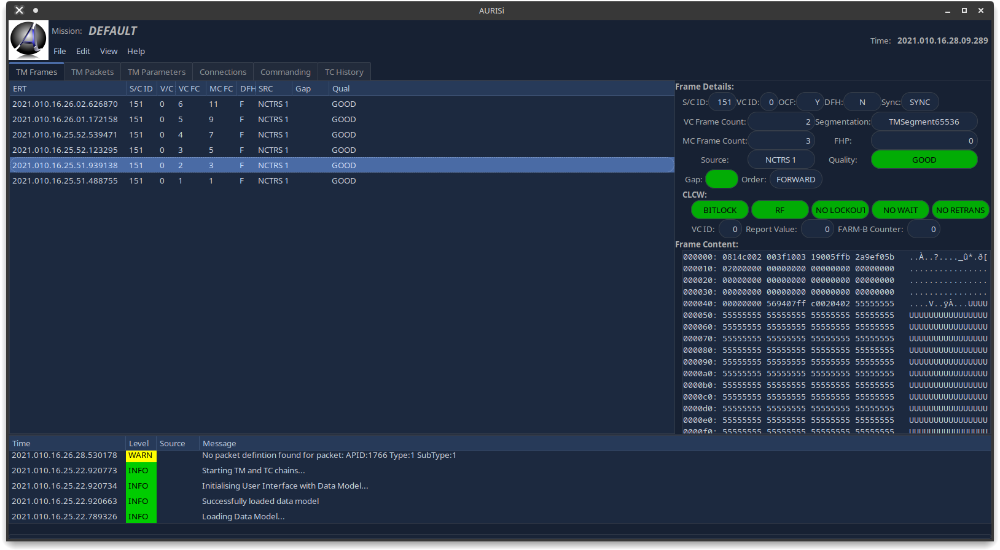
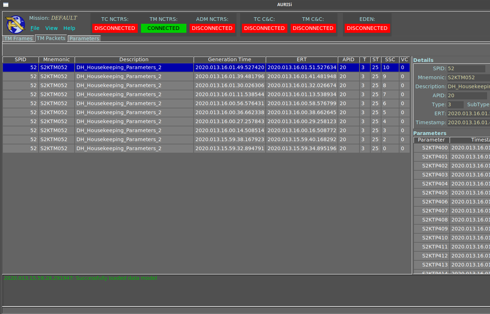
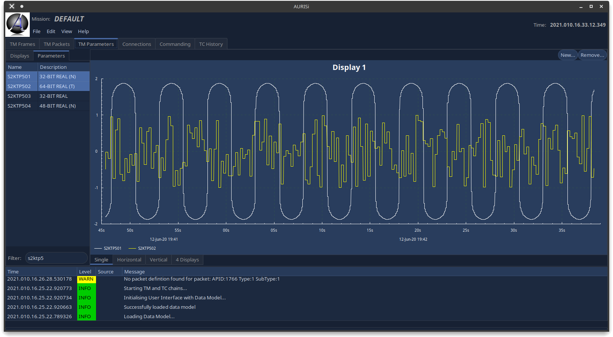
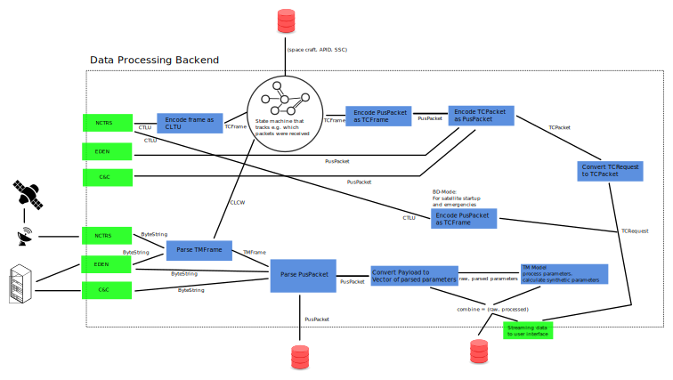

# AURIS

A new, open source mission control system in Haskell

A mission control system is the ground software that controls satellites and space probes. An example of an actual operational system can be seen here (example from the European Space Operations Center ESOC, on the monitors): [ESA's SCOS-2000](https://www.esa.int/ESA_Multimedia/Images/2015/08/Mission_control_system)
or from the German Space Operations Center (GSOC): [DLR GECCOS](https://www.aerosieger.de/images/news_picupload/pic_sid13250-1-norm.jpg)

## First Screenshots

Telemetry Frame Display:



Telemetry Packet Display:



Graphical Parameter Display:
➜



## Building 

Currently, building via stack is recommended. Cabal new-* commands should also work, but currently there is no cabal.project file available. 

There are some dependencies need beforehand (for Debian based systems):

```
sudo apt-get install build-essential autoconf libxft-dev libfltk1.3-dev libx11-dev -y
```
There are 3 stack.yaml files provided:
 * stack.yaml: this is for developing with non-optimized code
 * stack_opt.yaml: this is for the optimized build (much slower)
 * stack_llvm:yaml: optimized build via LLVM (much much slower)

Some users have reported build issues with fltkhs. As a workaround, you can just install fltkhs before building AURIS.

```
git clone http://github.com/deech/fltkhs-hello-world
cd ./fltkhs-hello-world
stack install --flag fltkhs:bundled
cd <path to AURIS checkout>
stack build
```

### Using nix

This project can also be built using `nix-build`. This will use
[https://github.com/input-output-hk/haskell.nix](haskell.nix) to derive nix
expressions from the `stack.yaml` and then build the local packages using the
same versions as in the stackage `resolver` and `extra-deps`. However many of
the packages might not be pre-built, but you can try to use `cachix` from
`iohk`:

``` sh
cachix use iohk
nix-build -A esa-space-protocols.components.all
ls result/bin
# CommandingAD  CommandingTest  EventLoggingDBTest  TMModelTest  TMSimulatorTest  WriteConfig
```

There is also a `shell.nix` which provides build tools and dependencies like `ghc`, `cabal` and `stack` and `ghcide`. Inside the shell you can build using `cabal` and `stack --no-nix --system-ghc --no-install-ghc`, or let `stack --nix` use the `shell.nix` (but this requires `stack` on your host system).

If you have [https://github.com/target/lorri](lorri) set up, you get this things even set up when cd'ing in this environment!

## Data Processing

The architecture of the data processing backend looks like this:



The real code is a bit more involved and complicated and is constantly growing. All data processing is currently done in 'esa-space-protocols' which is the main library

## User Interface 

The libraries are designed so that they will be able to be used in a variety of situations: client/server, standalone as one binary, use the libraries alone in other projects etc. 

A standalone executable with a GUI is called AURISi (for AURIS integrated) in the 'aurisi' directory. Currently all it does is connect to a simulator via NCTRS protocol and display incoming telemetry packets and parameters

The AURISi executable uses FLTKHS (thanks a lot Deech!) for the graphical user interface. 

## Database 

There is a preliminary implementation of a DB backend for events (thanks to Paolo and Matthias), but it is currently not used in AURISi (I had no time to add it). There is also an implementation of storing TM Frames, but due to a bug in Selda it is not present in this repository, but in Paolo's git account and will be merged at a later point in time. 

The idea is to support at least 2 backends: sqlite for testing campaigns and Postgres for MCS/CCS activities.

## Satellite Information Base

Currently the MIB library is under work to load satellite information from a MIB in SCOS-2000 Format (Version 6.9). It may be, that a CDM library for EGS-CC based configurations will follow (probably).

## Protocols

The currently working protocols are NCTRS (TC and TM), C&C (currently only TM) and EDEN (currently only TM). Since NCTRS is not that common anymore, other protocols will also be supported. 

Work has already begun on the implementation of an SLE library, to be able to connect to ground stations without relay/routing software as for NCTRS. The SLE implementation is in a very early state and currently not usable and can be found here: [esa-sle](https://github.com/oswald2/esa-sle)


## Notes

 * The [hashtables](https://github.com/gregorycollins/hashtables) library has been forked and directly put into this mono-repo. What has been modified is that an immutable hash table type has been added (but only for the Basic ST hash table), which can be obtained by calling `unsafeFreeze`. This allows to pass the HashTable out of the ST monad, but also only read-only functions are allowed. Currently, only `ilookup`, `fold` and `toList` are implemented.
 * The timer functionality is still undecided. Currently, timer-wheel is used, but this has not been updated for newer GHC versions. Probably updatable-timers from Paolo will be the go-to, otherwise probably some posix timers or similar would have to be used (if portable). GHC's timer in the event manager is only available on Linux.
